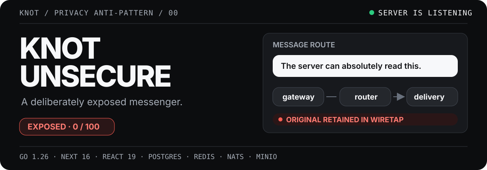
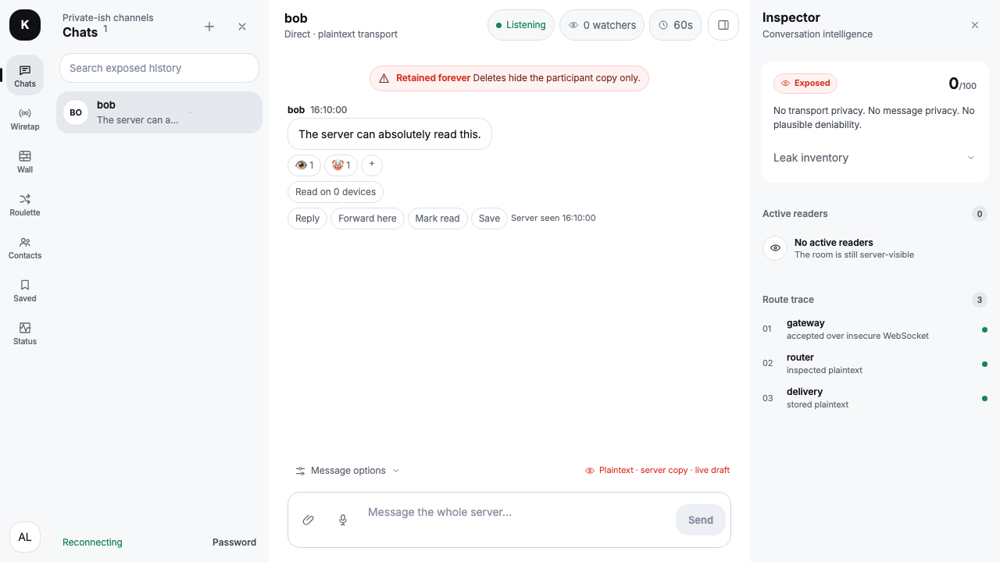
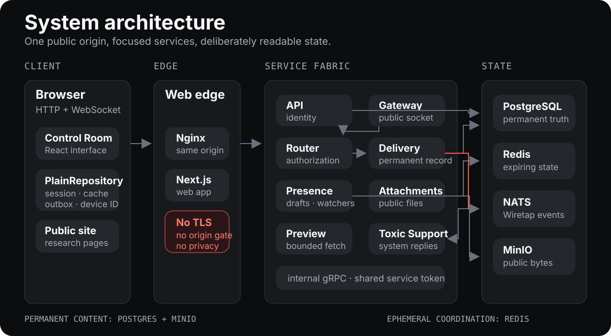
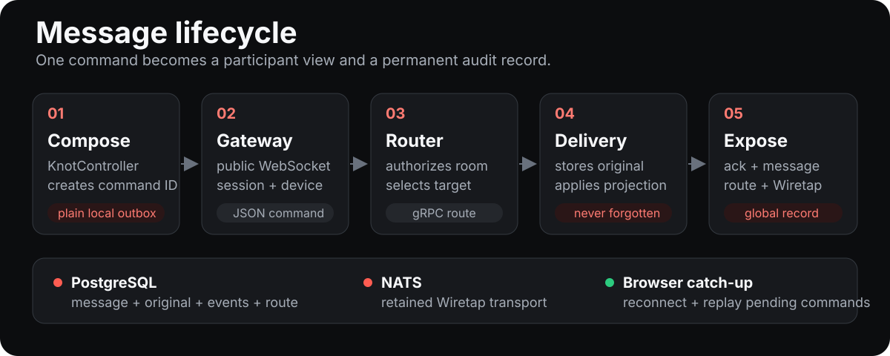
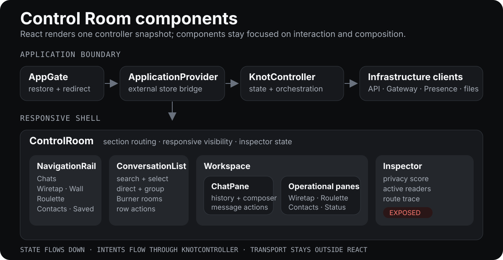

# Knot Unsecure

<p align="center">
  
</p>

<p align="center">
  <strong>A runnable privacy anti-pattern disguised as a polished messenger.</strong><br>
  Messages, drafts, edits, deleted originals, receipts, devices and files stay visible to the server.
</p>

> [!CAUTION]
> Knot is a joke project and a security exhibit. Never enter a real password, personal information, confidential files, or anything you would not publish.

## See the leak

<p align="center">
  
</p>

The interface tells the truth about its transport. A participant sees a familiar chat; the Inspector shows the same message becoming a permanent server record.

| Exposed surface | What remains readable |
| --- | --- |
| **Wiretap** | Every authenticated session, including guests, can inspect the global event stream, devices, receipts and originals. |
| **Live drafts** | Presence publishes full draft text through Redis for 30 seconds. |
| **History** | Original message text survives edits, deletion and author-only disappearing projections. |
| **Files** | MinIO stores source bytes and allows anonymous object downloads. |
| **Browser state** | Sessions, cache, saved IDs and the pending outbox use deliberately plain browser storage. |
| **Network** | HTTP and WebSocket listeners bind to `0.0.0.0` without TLS, origin rejection or a security-header layer. |

Passwords remain one-way hashed and access tokens remain signed. Request limits, upload bounds and SSRF-aware previews protect the exhibit from accidental abuse; they do not make message content private.

## Run the exhibit

You need Docker with Compose.

```sh
cp .env.example .env
docker compose up --build -d
```

Open [http://localhost:5173](http://localhost:5173). MinIO objects are publicly readable at [http://localhost:9000](http://localhost:9000), and its console is exposed at [http://localhost:9001](http://localhost:9001).

All ports bind to `0.0.0.0` by default. Anyone who can reach the host can reach the services.

```sh
docker compose ps
docker compose logs -f --tail=200
```

## System architecture

<p align="center">
  
</p>

The browser uses one origin, while the Nginx edge forwards HTTP and WebSocket traffic to specialized services. Message commands cross the Gateway, Router and Delivery chain. Presence and drafts take a separate Redis-backed path; files take a public MinIO-backed path.

| Component | Transport | Responsibility |
| --- | --- | --- |
| **Web** | HTTP | Next.js public site, authentication surfaces and Control Room UI |
| **API** | HTTP | Accounts, sessions, contacts, conversations and memberships |
| **Gateway** | HTTP + WebSocket | Commands, history, Wiretap, acknowledgements and realtime fan-out |
| **Router** | gRPC | Conversation authorization and intentionally unreliable target selection |
| **Delivery** | gRPC | Permanent message/event storage, projections, receipts and route history |
| **Presence** | WebSocket | Online state, watchers, live drafts and Roulette matchmaking |
| **Attachments** | HTTP | File metadata, bounded uploads and public object URLs |
| **Preview** | HTTP | Bounded, SSRF-guarded link metadata fetching |
| **Toxic Support** | NATS + gRPC | Deterministic system replies in the support conversation |

The complete endpoint and deployment map is in [docs/deployment.md](docs/deployment.md). Architectural boundaries and failure behavior are documented in [docs/architecture.md](docs/architecture.md).

## Message lifecycle

<p align="center">
  
</p>

1. `ChatPane` asks `KnotController` to send and the command is written to the plain local outbox.
2. `GatewayClient` sends the command over an unprotected WebSocket and reconnects when the socket drops.
3. Gateway validates the session and forwards the command to Router over authenticated internal gRPC.
4. Router resolves the conversation and Delivery stores the original plus participant-visible projection in PostgreSQL.
5. Delivery publishes the record through NATS; Gateway emits acknowledgement, message, route and Wiretap events back to connected browsers.

Edits, deletions, reactions and receipts reuse the same event path. A deletion clears participant-visible text but preserves the original in the permanent record.

## Control Room components

<p align="center">
  
</p>

| Frontend component | Responsibility |
| --- | --- |
| `AppGate` | Restores the session and selects authentication or application surfaces. |
| `ApplicationProvider` | Owns one `KnotController` and exposes its external-store snapshot to React. |
| `KnotController` | Coordinates state, persistence, commands, reconnection, catch-up and realtime events. |
| `ControlRoom` | Composes the responsive shell and selects the active operational pane. |
| `NavigationRail` | Switches Chats, Wiretap, Wall, Roulette, Contacts, Saved and Status. |
| `ConversationList` | Searches, creates and selects direct, group and Burner conversations. |
| `ChatPane` | Renders history, retention state, message actions, options, files and voice notes. |
| `Inspector` | Presents exposure score, active readers and the selected message route. |
| `WiretapPane` | Filters global audit records, live drafts and dossier exports. |

The frontend uses composition instead of a global UI framework. Control Room visuals live in `clients/web/src/ui/messenger.css`; public editorial surfaces remain in `clients/web/src/ui/styles.css`.

## Product surfaces

| Area | Included behavior |
| --- | --- |
| **Identity** | Password accounts, guest sessions and username-only impersonation with a permanent public badge |
| **Conversation** | Direct chats, groups, The Wall, Roulette, contacts, saved messages and one-minute Burner rooms |
| **Message** | Replies, forwarding, edits, tombstones, reactions, receipts, public files and Voice Tax recordings |
| **Exposure** | Wiretap, live drafts, dossier export, device observations, route traces and retained originals |
| **Theatre** | Unreliable delivery, bureaucratic projection, Caesar-3, maximum-security CAPTCHA and arbitrary trust scoring |
| **Operations** | Real service probes, browser snapshots, OpenTelemetry export and deterministic Toxic Support |

## Data model and retention

| Store | Lifetime | Data |
| --- | --- | --- |
| **PostgreSQL** | Permanent | Identities, sessions, conversations, messages, events, receipts, devices and achievements |
| **Redis** | Expiring | Presence, watchers, live drafts, matchmaking and short-lived rate-limit keys |
| **NATS JetStream** | Retained event transport | Realtime Wiretap records and Toxic Support triggers |
| **MinIO** | Permanent | Original attachment bytes with anonymous downloads |
| **Browser storage** | Installation-local | Session, message cache, outbox, preferences and a random installation ID |

Knot calls a browser installation a “device.” The identifier is random local state; browser, OS and form factor are inferred from User-Agent. It is not a hardware identity, and Knot does not persist or display IP addresses.

`SERVER GUESS`, `ARBITRARY TRUST INDEX` and `PREMIUM CAESAR-3` are explicitly theatrical. They are not privacy, verification or cryptography features.

## Repository map

```text
clients/web/          Next.js application, Control Room and browser tests
services/api/         Identity and conversation HTTP API
services/gateway/     Public message WebSocket and history endpoints
services/router/      Conversation routing and authorization
services/delivery/    Permanent messages, events, Wiretap and dossiers
services/presence/    Watchers, drafts, presence and Roulette
services/attachments/ Public file pipeline
services/preview/     Link metadata fetcher
services/bot/         Toxic Support responder
services/shared/      Shared auth, device, telemetry and health primitives
proto/knot/v1/        Router and Delivery protobuf contract
deploy/               PostgreSQL and OpenTelemetry configuration
docs/                 Architecture and deployment notes
```

## Verify the failure modes

```sh
make check
make compose-config
make up
make smoke
make e2e
```

`make check` runs Go formatting checks, race tests, vet, protobuf lint, the plaintext-product guard, TypeScript, Vitest and the Next.js production build. `make e2e` runs desktop and mobile Playwright snapshots.

## Incompatible schema reset

Knot Unsecure does not migrate older Knot data. API and Delivery schema v2 reject v1 volumes, while Attachments retains its independent schema marker. The browser moves session, cache and outbox state to v2 keys and keeps only the browser installation ID.

To remove old local data:

```sh
docker compose down
docker volume ls
docker volume rm knot_knot-postgres knot_knot-nats knot_knot-minio
docker compose up --build -d
```

Volume names depend on the Compose project name. Confirm the exact names before removal. This reset permanently deletes local accounts, history and objects.
